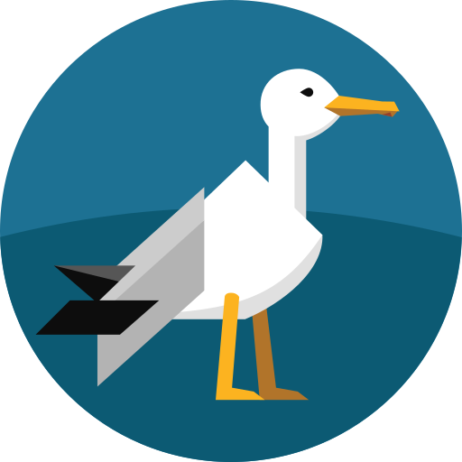

<p align="center" width="100%"></p>

# Patch

*Patch*, named after the [SeaGL] mascot, is a Matrix bot that assists with running the [SeaGL Matrix space].

## Usage

Install dependencies:

  - [Node.js], [Yarn], and the packages installed via `yarn install`

Populate environment variables:

  - [Matrix Client-Server API]:
    - `MATRIX_ACCESS_TOKEN`: Secret authentication token
    - `MATRIX_BASE_URL`: Homeserver base URL
    - `MATRIX_RATE_LIMIT`: Rate limit in hertz
    - `ISSUE_8895_COOLDOWN`: Seconds to wait before room creation ([matrix-org/synapse#8895])
  - [OSEM]:
    - `OSEM_RATE_LIMIT`: Rate limit in hertz

Build the bot:

```bash
yarn build
```

Start the bot:

```bash
yarn start
```

[Matrix Client-Server API]: https://spec.matrix.org/v1.4/client-server-api/
[matrix-org/synapse#8895]: https://github.com/matrix-org/synapse/issues/8895
[Node.js]: https://nodejs.org/
[OSEM]: https://osem.seagl.org/
[SeaGL]: https://seagl.org/
[SeaGL Matrix space]: https://seagl.org/meet
[Yarn]: https://yarnpkg.com/
